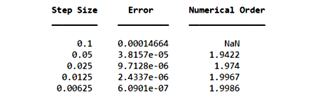

# Peaceman–Rachford Alternating Direction Implicit (ADI) Method for Solving 2D Parabolic Equations

In the code given in this repository, we implement the Peaceman-Rachford ADI method for solving the two‐dimensional parabolic equation

$$
\begin{align}
     u_t &= u_{xx} + u_{yy}, \quad (t,x,y) \in [0,T] \times D, & \\
     u(x, y, t) & = g(x, y, t), \quad (t,x,y) \in [0,T] \times \partial D, & \quad \quad [1]\\
     u(x, y, 0) & = u_0(x, y),
\end{align}
$$

In this particular instance, we choose to set $D = [0, 1]^2$ and $T = 1$.

We also have

$$
\begin{align}
     g(x, y, t) & = \exp\left(\frac{3t}{2}\right)\text{sin}\left(\frac{x - y}{2}\right)\text{cosh}\left(x+y\right), \\
     u_0(x, y) & = \text{sin}\left(\frac{x - y}{2}\right)\text{cosh}\left(x+y\right),
\end{align}
$$

The ADI method is a finite difference scheme that works as follows:

## Spatial and Temporal Discretization

1. **Spatial Grid.** We discretize $D$ with the uniform grid $D_h$ (grid spacing $h = \frac{1}{m}$) given by

   $$D_h \\: = \\: \lbrace (x_i,y_j) \in D \\: : \\: x_i = ih,\\: y_j = jh, \\: 0 \le i,j \le m \rbrace $$
   
   In other words, we place a uniform mesh of $(m+1)\times(m+1)$ points on $[0,1]^2$.

3. **Time Step.**  We choose $k = h$, where $t_n = nk$

4. **Discrete Laplacian Operators.**  For any grid‐function $w_{i,j}$, define $\delta_x^2$ and $\delta_y^2$ such that

$$\begin{align}
&\delta_x^2 w_{i, j} = \frac{w_{i+1,j} - 2\,w_{i,j} + w_{i-1,j}}{h^2} \quad \quad [2a] \\
\text{and} \\
& \delta_y^2 w_{i, j} = \frac{w_{i,j+1} - 2\,w_{i,j} + w_{i,j-1}}{h^2} \quad \quad [2b]
\end{align}$$

These act on interior indices $1 \le i,j \le m-1$

---

## ADI Method: 

### Pointwise Computation

The essential part of the ADI algorithm is to compute $u^{n+1}$ (approximate solution at time $t_{n+1}$) from $u^n$ in two steps:

1.
$$(1 - \frac{1}{2}k \delta_x^2)u^* = (1 + \frac{1}{2}k \delta_y^2)u^n \quad \quad \quad [3a]$$

2.
$$(1 - \frac{1}{2}k \delta_y^2)u^{n+1} = (1 + \frac{1}{2}k \delta_x^2)u^* \quad \quad [3b]$$

### Gridwise Computation

Suppose we implement our numerical scheme such that the discretized solution at time $t_n$ is given by the matrix $U^n$ with $U_{ij}^n \approx u(x_i, y_j, t_n)$ with $1 \le i,j \le m-1$. We can use this to give matrix representations of $\delta_x^2$ and $\delta_y^2$.

Let $w \in \mathbb{R}^{d}$ be a column vector. We observe that the matrix $A$ given by

$$
A = \frac{1}{h^2}
\begin{bmatrix}
-2 & 1 & 0 & \cdots & 0 \\
1 & -2 & 1 & \ddots & \vdots \\
0 & 1 & -2 & \ddots & 0 \\
\vdots & \ddots & \ddots & \ddots & 1 \\
0 & \cdots & 0 & 1 & -2
\end{bmatrix}
\in \mathbb{R}^{d \times d}
$$

has the same effect on $w$ as $\delta_x^2$ does (except at the boundaries) if $w$ is varying in $x$. Similarly, $A$ has the same effect on $w$ as $\delta_y^2$ does (except at the boundary) if $w$ is varying in $y$. 

Let $v : = Aw$. Since Since the term $\frac{w_{i-1}}{h^2}$ is missing from $v_1$ and $\frac{w_{i+1}}{h^2}$ from $v_d$, we add these terms manually.

We can use this information to generalize equations $[3a]$ and $[3b]$ to the following linear systems:

1.
$$(I - \frac{1}{2}k A)U^* + G_x^* = \lbrack(I + \frac{1}{2}k A)(U^n)^T + (G_y^n)^T\rbrack ^T, \quad \quad \quad [4a]$$

2. 
$$\lbrack(I - \frac{1}{2}k A)(U^n)^T + (G_y^{n+1})^T\rbrack ^T = (I + \frac{1}{2}k A)U^* + G_x^*, \quad \quad \quad [4b]$$

Where $I, \\: A, \\: G_x, \\: G_y \in \mathbb{R}^{m-1 \times m-1}$

Note that the boundary conditions given by $G_x^* \\:$ can be obtained by solving for $G_x^* \\:$ using the system of equations in $[4]$ on the boundary (giving the best accuracy) or by simply using $G_x^* \approx g(x, y_j, t_n + \frac{k}{2})$ where $j = 0$ or $m$.

## MATLAB Code

Below is the main script (`ADI method.mlx`) that sets up the grid hierarchy, computes errors, and displays results.  The function `ADI` (in a separate file `ADI.m`) carries out the two‐step fractional solves described above.

```matlab

% This script computes the ADI solution for the test problem
% and tabulates the maximum error and estimated order of convergence.

g = @(x, y, t) exp(3*t/2).*sin(1/2*(x-y)).*cosh(x+y);
u_0 = @(x, y) sin(1/2*(x-y)).*cosh(x+y);
t_N = 1;
u_exact = @(x, y, t) exp(3*t/2) * sin(1/2*(x-y)).*cosh(x+y);

% Refinement levels: h = 0.1 * 2.^(-p), for p = 0:4
p = 0:4;
h_vals = 0.1 * 2.^(-p);
err = zeros(length(h_vals), 3);

for i = 1:length(h_vals)

    % Spatial discretization
    h = h_vals(i);
    
    % Time‐step equals spatial step
    k = h;
    x = 0:h:1;
    y = 0:h:1; 
    
    m = length(x)-1;       % number of subintervals in each direction
    
    [X, Y] = ndgrid(x, y);
    
    % Exact solution at final time t_N
    U_exact = u_exact(X, Y, t_N);

    % Initial interior values (exclude boundary)
    U_init = u_0(X(2:end-1, 2:end-1), Y(2:end-1, 2:end-1));

    % Compute ADI solution (including boundary filling)
    U_ADI = ADI(U_init, g, h, k, t_N);

    % Record error and (approximate) convergence order
    err(i, 1) = h;
    err(i, 2) = max(abs(U_exact - U_ADI), [], 'all');
    if i ~= 1
        err(i, 3) = log2(err(i-1, 2) ./ err(i, 2));
    else
        err(i, 3) = NaN;
    end
end

% Display results in table form
T = array2table(err);
T.Properties.VariableNames = {'Step Size', 'Error', 'Numerical Order'};
disp(T)
```


```matlab:Code
figure; clf
interior_msk = (X ~= 0 & X~= 1) & (Y ~= 0 & Y~= 1);
surf(X, Y, U_exact); shading interp
colorbar
title("Exact Solution", "Interpreter", "latex")
xlabel("x", "Interpreter", "latex");
ylabel("y", "Interpreter", "latex");
zlabel("z", "Interpreter", "latex");
```


```matlab:Code
figure; clf
interior_msk = (X ~= 0 & X~= 1) & (Y ~= 0 & Y~= 1);
surf(X, Y, U_ADI); shading interp

% color map
cm = hot(256);
cm = cm(1:end-40, :); % truncate off last few rows
colormap(cm) % apply truncated map
caxis([min(U_ADI(:))   max(U_ADI(:))]) % restore the original caxis
colorbar
title("Numerical Solution on Finest Mesh", "Interpreter", "latex")
xlabel("x", "Interpreter", "latex");
ylabel("y", "Interpreter", "latex");
zlabel("z", "Interpreter", "latex");
```


```matlab:Code
figure; clf
surf(X, Y, abs(U_exact -  U_ADI)); shading interp
title("Error of Numerical Solution on Finest Mesh", "Interpreter", "latex");
xlabel("x", "Interpreter", "latex");
ylabel("y", "Interpreter", "latex");
zlabel("z", "Interpreter", "latex");
```

